# 🕉️ Sivoham: Complete Spiritual Growth Platform
## Comprehensive MVP Presentation

---

## 📋 Table of Contents
1. [Platform Overview](#platform-overview)
2. [User Experience Journey](#user-experience-journey)
3. [Core Features Deep Dive](#core-features-deep-dive)
4. [Admin Management System](#admin-management-system)
5. [Technical Architecture](#technical-architecture)
6. [Security & Performance](#security--performance)
7. [Deployment & Scalability](#deployment--scalability)
8. [Future Roadmap](#future-roadmap)

---

## 🎯 Platform Overview

### **Sivoham: Digital Spiritual Transformation Platform**
*Empowering seekers on the path of self-realization through Siva Kundalini Sadhana*

**Vision**: To make authentic spiritual teachings accessible to seekers worldwide through a comprehensive digital platform that combines traditional wisdom with modern technology.

**Mission**: Guided by Parama Pujya Sri Jeeveswara Yogi's teachings, we provide a structured, safe, and experiential approach to Kundalini awakening and spiritual growth.

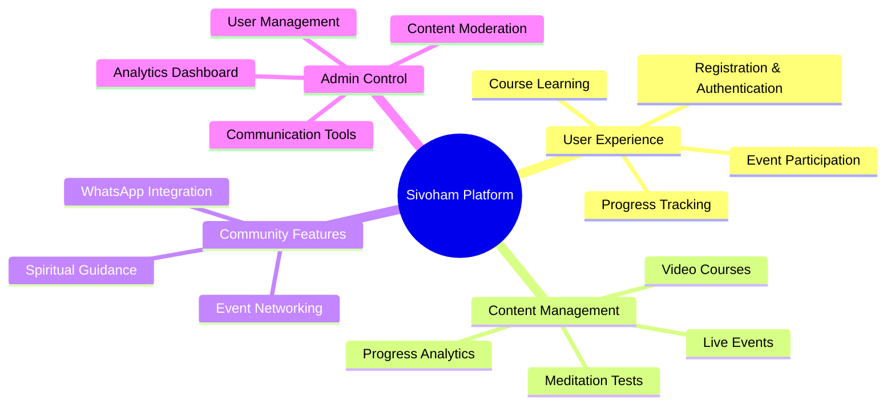

---

## 🚀 User Experience Journey

### **1. Landing & Discovery**
- **Beautiful Homepage**: Elegant design with spiritual aesthetics
- **About Guruji**: Detailed biography and teachings
- **Programs Overview**: 4-level structured course system
- **Gallery**: Visual journey of spiritual events
- **Testimonials**: Real experiences from practitioners

### **2. Registration Process**


**Registration Features**:
- **Comprehensive Form**: Personal details, spiritual background, references
- **Mobile-First Design**: Responsive forms for all devices
- **Validation**: Real-time form validation and error handling
- **Multi-Step Process**: Organized information collection
- **Reference Tracking**: Source attribution for community growth

### **3. Authentication System**
- **OTP-Based Login**: Secure mobile number verification
- **Demo Mode**: Easy testing with 123456 OTP
- **Session Management**: Persistent login across devices
- **Security**: JWT token-based authentication

---

## 🎓 Core Features Deep Dive

### **A. Structured Course System**

#### **Level 1: Brahma Randra Opening**
- **Objective**: Open the crown chakra for cosmic energy reception
- **Content**: Video lessons, guided meditations, theory
- **Duration**: Progressive daily practice
- **Outcome**: Energy healing at physical, psychological, and spiritual levels

#### **Level 2: Sushumna Nadi Awakening**
- **Objective**: Activate the central spiritual energy channel
- **Advanced Techniques**: Brahma Nadi entry methods
- **Progress Tracking**: Daily session monitoring
- **Milestone**: Sustained Sushumna activation

#### **Level 3: Seven Chakras Awakening & Cleansing**
- **Comprehensive System**: All major energy centers
- **Detailed Instruction**: Chakra-specific techniques
- **Balancing Methods**: Energy harmonization practices
- **Higher Consciousness**: Unlocking elevated awareness states

#### **Level 4: Kundalini Energy Movement**
- **Advanced Practice**: Mooladhara to Sahasrara energy flow
- **Master Techniques**: Complete energy circulation
- **Spiritual Culmination**: Realizing human potential
- **Integration**: Daily life application

#### **Level 5: Event Preparation**
- **Special Preparation**: For live spiritual events
- **Community Integration**: Group practice readiness
- **Advanced States**: Samadhi preparation
- **Graduation**: Ready for in-person guidance

### **B. Interactive Learning Features**

#### **Video Player System**
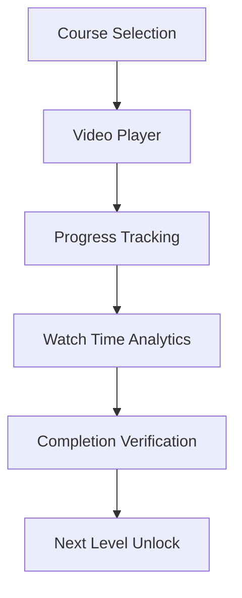

**Player Features**:
- **HLS Streaming**: Adaptive quality based on connection
- **CDN Integration**: Fast global content delivery
- **Progress Saving**: Resume from last position
- **Speed Controls**: Customizable playback speed
- **Offline Capability**: Download for offline viewing

#### **Meditation Test System**
- **Interactive Testing**: Practical meditation evaluation
- **Timer Integration**: Structured meditation sessions
- **Progress Validation**: Completion verification
- **Feedback System**: Personalized guidance
- **Advancement Criteria**: Level progression requirements

### **C. Progress Analytics**
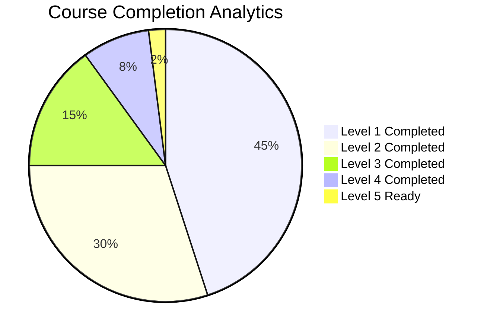

**Tracking Features**:
- **Watch Time**: Detailed session analytics
- **Daily Progress**: Consistent practice monitoring
- **Level Completion**: Milestone achievement tracking
- **Meditation Records**: Test performance history
- **Personal Dashboard**: Individual progress visualization

---

## 🎪 Event Management System

### **Event Types**
1. **Unlimited Events**: Open registration for all approved users
2. **Limited Events**: Approval-required exclusive gatherings
3. **Live Streaming**: Virtual participation options
4. **Hybrid Events**: Combined physical and digital attendance

### **Event Features**
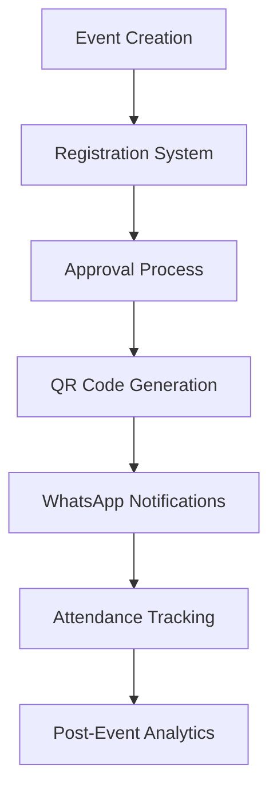

#### **Registration Process**
- **Detailed Forms**: Comprehensive participant information
- **Approval Workflow**: Admin review and selection
- **Automated Notifications**: WhatsApp integration
- **QR Code System**: Digital entry management
- **Capacity Management**: Venue-based limitations

#### **Digital Integration**
- **QR Code Generation**: Unique participant identification
- **WhatsApp Templates**: Customizable notification messages
- **Barcode Scanning**: Mobile-friendly entry system
- **Real-time Updates**: Live registration status
- **Attendance Verification**: Digital check-in system

---

## 🛡️ Admin Management System

### **Multi-Level Admin Architecture**
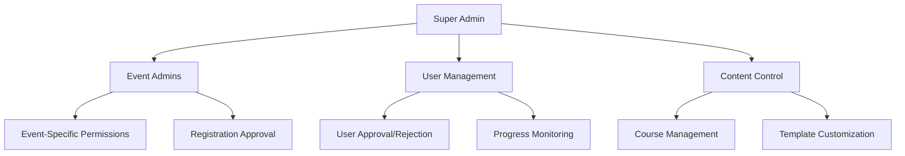

### **A. User Management Dashboard**

#### **User Registration Requests**
- **Comprehensive Review**: Detailed applicant information
- **Bulk Operations**: Mass approval/rejection capabilities
- **WhatsApp Integration**: Direct communication tools
- **Status Tracking**: Application progress monitoring
- **Advanced Filtering**: Multi-criteria search and sort

#### **All Users Management**
- **Complete User Database**: Comprehensive user information
- **Course Progress Analytics**: Detailed learning statistics
- **Watch Time Reports**: Engagement metrics
- **Communication Tools**: Direct WhatsApp messaging
- **User Lifecycle Management**: From registration to completion

### **B. Event Management**

#### **Event Creation & Management**
- **Rich Event Editor**: Comprehensive event details
- **Date & Time Management**: Scheduling with timezone support
- **Venue Information**: Location and capacity details
- **Registration Controls**: Open/limited registration types
- **Banner Management**: Homepage event promotion

#### **Event Registration Approval**
- **Detailed Applicant Profiles**: Complete registration information
- **Approval Workflow**: Structured review process
- **QR Code Generation**: Automated entry system
- **WhatsApp Notifications**: Template-based messaging
- **Attendance Tracking**: Digital check-in management

#### **Event Analytics**
- **Registration Statistics**: Comprehensive participation data
- **Attendance Reports**: Event success metrics
- **User Demographics**: Participant analysis
- **Engagement Metrics**: Event interaction data

### **C. Communication System**

#### **WhatsApp Template Management**
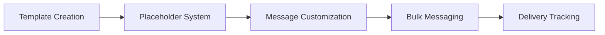

**Template Features**:
- **Dynamic Placeholders**: {name}, {eventName}, {eventDate}, {registrationId}
- **Event-Specific Templates**: Customizable per event
- **User Registration Templates**: Welcome and approval messages
- **QR Code Integration**: Embedded entry information
- **Delivery Tracking**: Message sent status monitoring

#### **Advanced Communication Tools**
- **Bulk Messaging**: Mass communication capabilities
- **Status Tracking**: Message delivery confirmation
- **Template Library**: Pre-built message templates
- **Personalization**: Individual message customization
- **Integration**: Direct WhatsApp Web connectivity

### **D. Upcoming Features**

#### **Merchandise Management** (In Development)
- **Product Catalog**: Spiritual books and sacred items
- **Inventory Tracking**: Stock management system
- **Order Processing**: Purchase and delivery management
- **Payment Integration**: Secure transaction processing

#### **Sevaks Management** (In Development)
- **Volunteer Coordination**: Service opportunity management
- **Assignment System**: Task distribution and tracking
- **Contribution Tracking**: Service hour monitoring
- **Community Building**: Volunteer network development

---

## 🔧 Technical Architecture

### **Frontend Technology Stack**
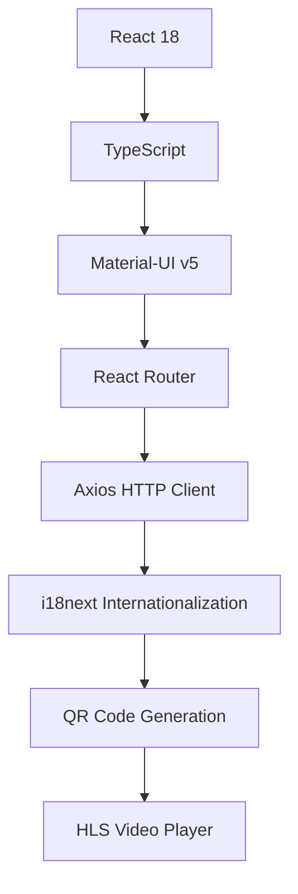

**Key Technologies**:
- **React 18**: Modern component architecture with hooks
- **TypeScript**: Type-safe development environment
- **Material-UI v5**: Professional component library
- **Responsive Design**: Mobile-first approach
- **Progressive Web App**: Offline capabilities
- **Error Boundaries**: Graceful error handling

### **Backend Architecture**
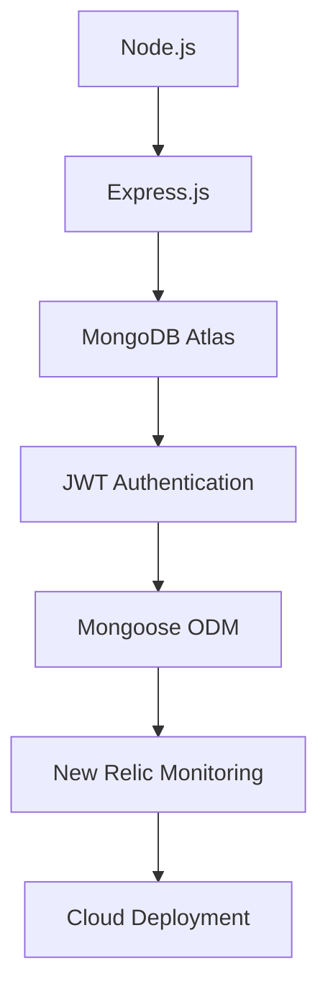

**Backend Features**:
- **RESTful API**: Clean, documented endpoints
- **MongoDB**: Flexible document database
- **JWT Security**: Stateless authentication
- **Input Validation**: Comprehensive data validation
- **Error Handling**: Structured error responses
- **Logging**: Comprehensive activity tracking

### **Database Schema**
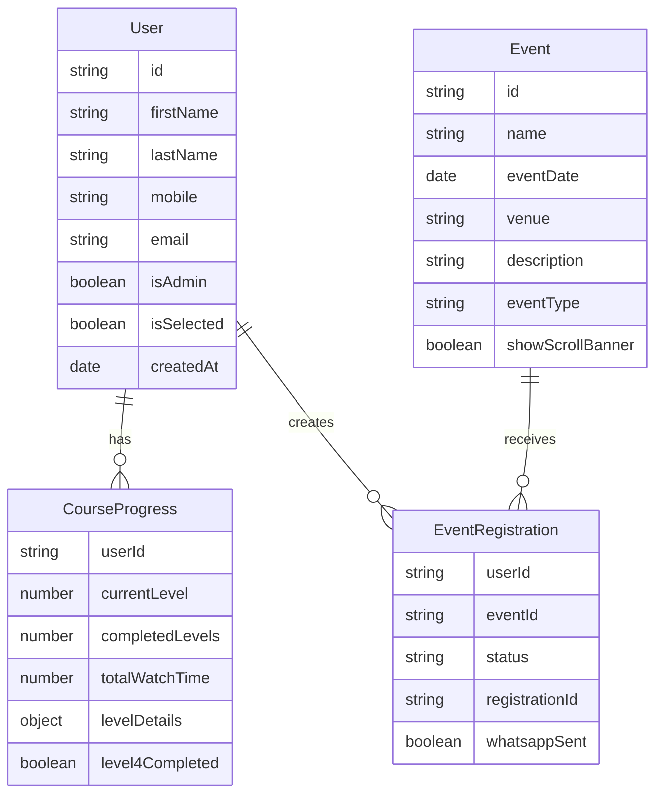

---

## 🔒 Security & Performance

### **Security Measures**
- **JWT Authentication**: Secure token-based access
- **Input Sanitization**: XSS and injection prevention
- **Rate Limiting**: API abuse protection
- **HTTPS Encryption**: Secure data transmission
- **Environment Variables**: Sensitive data protection
- **Error Boundaries**: Graceful failure handling

### **Performance Optimizations**
- **Code Splitting**: Lazy loading for optimal performance
- **CDN Integration**: Fast global content delivery
- **Caching Strategy**: Efficient data retrieval
- **Image Optimization**: Compressed media assets
- **Bundle Optimization**: Minimized JavaScript bundles
- **Database Indexing**: Optimized query performance

### **Monitoring & Analytics**
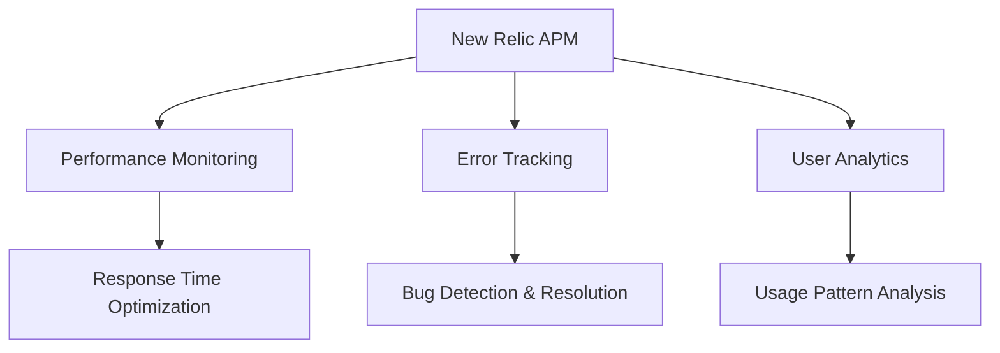

---

## 🚀 Deployment & Scalability

### **Deployment Options**

#### **Docker Containerization**
```dockerfile
# Example Backend Dockerfile
FROM node:18
WORKDIR /app
COPY backend ./backend
COPY package*.json ./
RUN npm install --prefix backend
ENV NODE_ENV=production
ENV USE_STATELESS_MODE=true
EXPOSE 5000
CMD ["node", "backend/server.js"]
```

#### **Kubernetes Deployment**
```yaml
apiVersion: apps/v1
kind: Deployment
metadata:
  name: sivoham-backend
spec:
  replicas: 3
  selector:
    matchLabels:
      app: sivoham-backend
  template:
    spec:
      containers:
      - name: backend
        image: sivoham-backend:latest
        ports:
        - containerPort: 5000
        env:
        - name: USE_STATELESS_MODE
          value: "true"
        - name: MONGO_URI
          valueFrom:
            secretKeyRef:
              name: mongo-secret
              key: uri
```

### **Environment Configuration**
```bash
# Production Environment Variables
USE_STATELESS_MODE=true
ENABLE_NEWRELIC=true
NEW_RELIC_LICENSE_KEY=your_key
NEW_RELIC_APP_NAME=Sivoham_Production
MONGO_URI=mongodb+srv://cluster.mongodb.net/sivoham
JWT_SECRET=your_secure_jwt_secret
PORT=5000
```

### **Scalability Features**
- **Horizontal Scaling**: Multiple server instances
- **Load Balancing**: Traffic distribution
- **Database Clustering**: MongoDB replica sets
- **CDN Integration**: Global content delivery
- **Auto-scaling**: Dynamic resource allocation
- **Health Checks**: Automated monitoring and recovery

---

## 📊 Analytics & Insights

### **User Engagement Metrics**
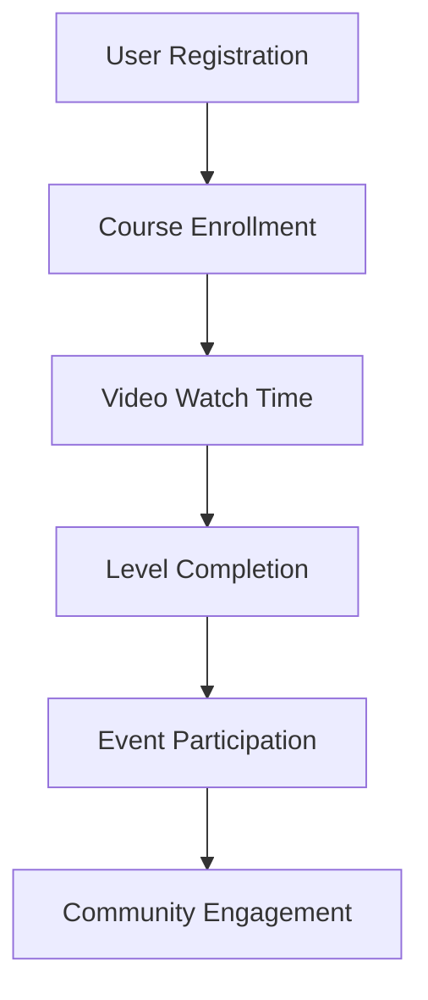

### **Key Performance Indicators**
- **User Acquisition**: Registration and approval rates
- **Course Completion**: Level progression statistics
- **Engagement**: Watch time and session frequency
- **Event Participation**: Registration and attendance rates
- **Community Growth**: User referral and retention metrics

### **Admin Dashboard Analytics**
- **Real-time Statistics**: Live user and event data
- **Progress Reports**: Detailed learning analytics
- **Communication Metrics**: WhatsApp message delivery rates
- **System Performance**: Technical health monitoring
- **Growth Trends**: Historical data analysis

---

## 🌟 User Testimonials

### **Spiritual Transformation Stories**

> *"I spent many years in Himalayas and travelled across India in pursuit of Moksha. I met many Siddha Gurus and realized that even though they have so many powers they themselves are not liberated. Only a self-experienced person can guide others to the path of liberation. When I heard of Guru Sri Jeeveswara Yogi I immediately rushed down to meet him. I experienced him as one of the rarest Advaitha Shaktipath Guru and we cannot find one like him anywhere else in this era."*  
> **— Ramananda Swami, Sanyasi, Badrinath**

> *"Parama Pujya Sri Jeeveswara Yogi is none the less than Dakshinamurthy himself disguised as a common man incarnated to uplift ignorant people like us with boundless Compassion. We might have made great Punya in our past lives which lead us to learn such a wonderful sadhana today. To describe his greatness it is as difficult as trying to hold an ocean in a small vessel. He is Shiva himself."*  
> **— Mrs. Rajya Lakshmi, Retd. Teacher**

> *"I have read a lot of books on Kundalini and many Upanishads. However, there is only a mention of how to do and what to do in them. There is no one to teach the same to you practically. Sri Jeeveswara Yogi is imparting that practical knowledge whole heartedly without expecting anything from us. Guruji's intention is that everyone should get the knowledge from him and become like him."*  
> **— Mr. Suresh Kalimahanthi, IT Professional, USA**

---

## 🔮 Future Roadmap

### **Phase 1: Enhanced Features (Q2 2024)**
- **Mobile Application**: Native iOS and Android apps
- **Offline Mode**: Download courses for offline viewing
- **Advanced Analytics**: Detailed progress insights
- **Community Forums**: User interaction platform

### **Phase 2: Expansion (Q3 2024)**
- **Multi-language Support**: Telugu, Hindi, English
- **Live Streaming**: Real-time event broadcasting
- **Merchandise Store**: Spiritual books and items
- **Sevak Management**: Volunteer coordination system

### **Phase 3: Global Reach (Q4 2024)**
- **International Events**: Global spiritual gatherings
- **Advanced Meditation**: AI-guided meditation sessions
- **Personalized Learning**: Adaptive course paths
- **Integration APIs**: Third-party spiritual tools

### **Phase 4: Innovation (2025)**
- **VR/AR Experiences**: Immersive spiritual practices
- **AI Guidance**: Personalized spiritual mentoring
- **Blockchain Certificates**: Verified spiritual achievements
- **Global Community**: Worldwide practitioner network

---

## 💡 Innovation Highlights

### **Unique Platform Features**
1. **Authentic Spiritual Teaching**: Direct from realized master
2. **Progressive Learning System**: Structured 5-level approach
3. **Digital-Physical Integration**: Online learning + live events
4. **Community Building**: WhatsApp-integrated communication
5. **Comprehensive Analytics**: Detailed progress tracking
6. **Admin Excellence**: Multi-level management system

### **Technical Innovations**
- **Responsive Design**: Seamless mobile-desktop experience
- **Error Resilience**: Graceful failure handling
- **Performance Optimization**: Fast, efficient user experience
- **Security First**: Comprehensive protection measures
- **Scalable Architecture**: Growth-ready infrastructure

---

## 📈 Business Impact

### **Quantifiable Benefits**
- **Global Reach**: Accessible spiritual education worldwide
- **Scalable Teaching**: One guru reaching thousands simultaneously
- **Progress Tracking**: Measurable spiritual development
- **Community Building**: Connected global spiritual community
- **Efficient Management**: Streamlined administrative processes

### **Social Impact**
- **Spiritual Accessibility**: Breaking geographical barriers
- **Authentic Teaching**: Preserving traditional wisdom
- **Community Support**: Peer learning and encouragement
- **Personal Transformation**: Documented spiritual growth
- **Cultural Preservation**: Maintaining ancient practices

---

## 🎯 Call to Action

### **For Spiritual Seekers**
- **Join the Journey**: Register for transformative spiritual education
- **Experience Authenticity**: Learn from a self-realized master
- **Track Progress**: Monitor your spiritual development
- **Join Community**: Connect with fellow practitioners

### **For Administrators**
- **Manage Efficiently**: Comprehensive admin tools
- **Communicate Effectively**: Integrated messaging system
- **Track Analytics**: Detailed performance insights
- **Scale Operations**: Growth-ready infrastructure

### **For Developers**
- **Contribute**: Open-source spiritual technology
- **Innovate**: Enhance spiritual learning experiences
- **Collaborate**: Build the future of digital spirituality
- **Learn**: Explore cutting-edge web technologies

---

## 📞 Contact & Support

### **Platform Access**
- **Website**: [Sivoham Platform URL]
- **Demo Credentials**: Available for testing
- **Support Email**: [support@sivoham.org]
- **Documentation**: Comprehensive user guides

### **Technical Support**
- **Developer Documentation**: API and integration guides
- **Deployment Assistance**: Cloud setup support
- **Customization Services**: Tailored implementations
- **Training Programs**: Admin and user training

### **Community**
- **WhatsApp Groups**: Direct community access
- **Event Notifications**: Live event updates
- **Progress Sharing**: Community achievements
- **Spiritual Guidance**: Direct access to teachings

---

## 🙏 Acknowledgments

**Gratitude to Parama Pujya Sri Jeeveswara Yogi** for providing the authentic spiritual foundation that makes this platform possible.

**Thanks to the Development Team** for creating a robust, scalable, and user-friendly platform that serves the spiritual community.

**Appreciation to the Community** of practitioners who provide feedback and support for continuous improvement.

---

*"This Divine Knowledge and experience is of immense value which cannot be paid. Hence it is offered Free of cost."*  
**— Parama Pujya Sri Jeeveswara Yogi**

---

**🕉️ Jai Gurudev 🙏**